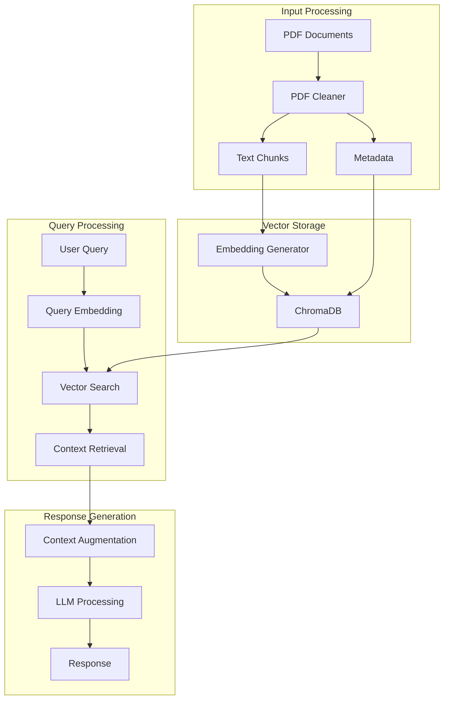

# RAG System Architecture

## System Overview
This document describes the architecture of the RAG (Retrieval-Augmented Generation) system, which combines document retrieval with language model generation to provide accurate and context-aware responses.

## Architecture Diagram



## Component Description

### 1. Input Processing
- **PDF Cleaner**: Processes PDF documents to extract and clean text
  - Removes unwanted characters and normalizes text
  - Splits text into overlapping chunks
  - Extracts metadata
  - Optimizes for RAG processing

### 2. Vector Storage
- **Embedding Generator**: Converts text chunks into vector embeddings
  - Uses sentence-transformers for embedding generation
  - Optimizes for semantic search
- **ChromaDB**: Stores and manages vector embeddings
  - Enables efficient similarity search
  - Maintains document metadata

### 3. Query Processing
- **Query Embedding**: Converts user queries into vector embeddings
- **Vector Search**: Finds relevant document chunks
  - Uses similarity search algorithms
  - Applies score thresholding
- **Context Retrieval**: Extracts relevant context
  - Processes retrieved chunks
  - Prepares context for LLM

### 4. Response Generation
- **Context Augmentation**: Combines query and context
  - Constructs optimized prompts
  - Ensures context relevance
- **LLM Processing**: Generates responses
  - Uses Hugging Face models
  - Applies response optimization
- **Response**: Returns final answer to user

## Performance Optimizations

### 1. Chunking Strategy
- Optimal chunk size: 1000 characters
- Overlap: 200 characters
- Sentence-aware splitting
- Context preservation

### 2. Vector Search
- Efficient similarity search
- Score thresholding
- Metadata filtering
- Result ranking

### 3. Response Generation
- Prompt engineering
- Context relevance scoring
- Response quality checks
- Error handling

## System Requirements

### Hardware
- CPU: 4+ cores
- RAM: 8GB minimum
- Storage: SSD recommended

### Software
- Python 3.7+
- PyTorch
- Transformers
- ChromaDB
- PDF processing libraries

## Deployment Guidelines

1. Install dependencies:
   ```bash
   pip install -r requirements.txt
   ```

2. Configure environment:
   - Set up model paths
   - Configure database settings
   - Set logging levels

3. Initialize system:
   - Create necessary directories
   - Set up vector database
   - Load models

4. Monitor performance:
   - Track response times
   - Monitor memory usage
   - Log errors and warnings

## Maintenance

### Regular Tasks
- Update dependencies
- Monitor system performance
- Clean up temporary files
- Backup vector database

### Troubleshooting
- Check log files
- Verify model loading
- Test vector search
- Validate responses

## API Documentation

### Main Endpoints
1. Document Processing
   ```python
   process_document(pdf_path: str) -> Dict[str, Any]
   ```

2. Query Processing
   ```python
   process_query(query: str, use_rag: bool = True) -> str
   ```

3. System Status
   ```python
   get_system_status() -> Dict[str, Any]
   ```

## Performance Metrics

### Key Indicators
- Response latency
- Retrieval accuracy
- Context relevance
- Response quality
- System resource usage

### Monitoring
- Real-time metrics
- Performance logs
- Error tracking
- Usage statistics 